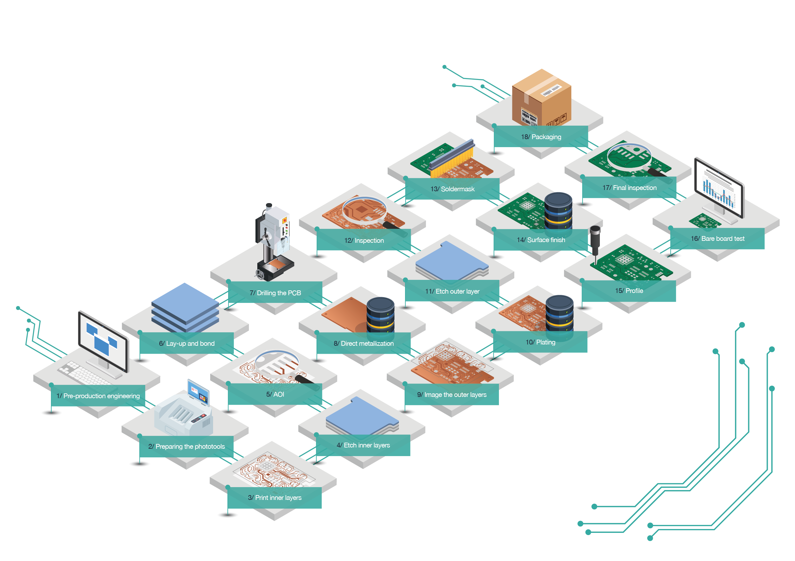
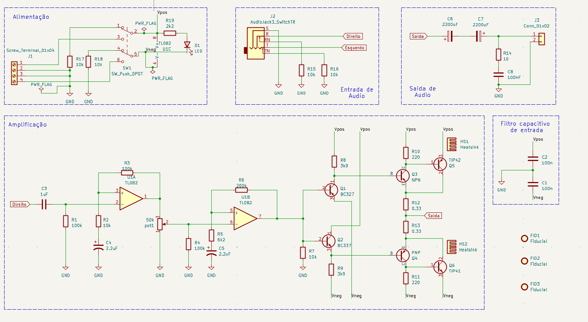
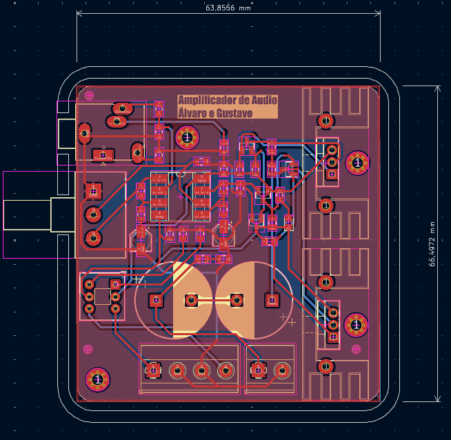
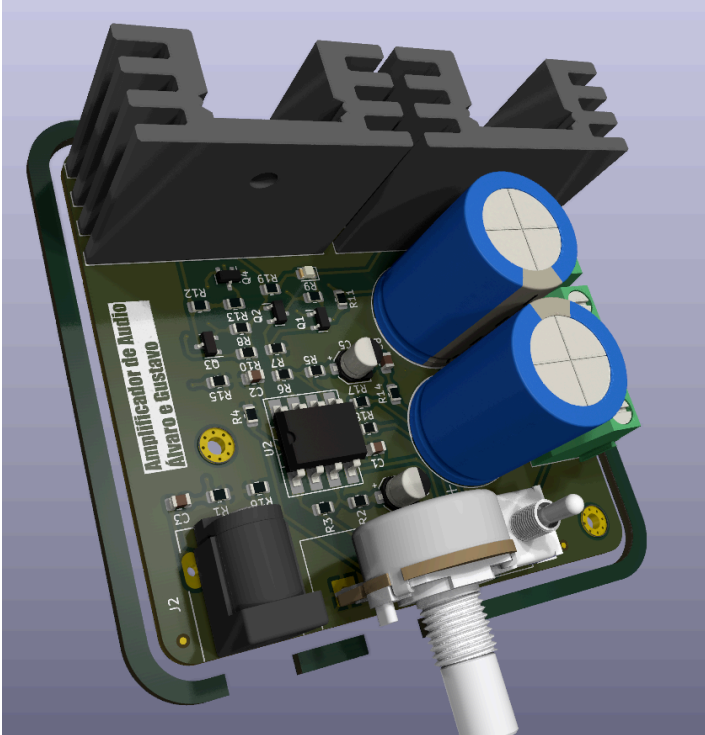

# 
 Desenvolvimento de PCB para amplificador de audio 

Este projeto foi desenvolvido como trabalho final da disciplina de `Desenvolvimento de Placas de Circuito Impresso`, com o objetivo de aplicar os principais conceitos envolvidos no desenvolvimento comercial e industrial de placas de circuito impresso (PCIs). o projeto da placa foi entregue junto do [relatório final](https://github.com/AlvaroLHBremm/Desenvolvimento-de-PCB/blob/main/relatorio/Relatorio.pdf).

<!--
O trabalho abordou diferentes etapas do processo de desenvolvimento de uma PCB, incluindo:

* Definição das características e requisitos da placa;
* Escolha de componentes e materiais;
* Posicionamento de componentes;
* Desenvolvimento do layout e roteamento das trilhas;
* Técnicas e processos de fabricação;
* Critérios relacionados à produção industrial;
* Identificação de possíveis falhas de projeto e problemas durante o processo de fabricação.

A definição dos requisitos da placa e escolha de componentes são fatores vistos durante a disciplina mas não foram abordadas no projeto final, pois seu objetivo era de desenvolver uma placa de circuito impresso, e não o projeto do circuito eletrônico em si. O professor disponibilizou diferentes circuitos que poderiam ser utilizados como base. Também era permitido utilizar um circuito desenvolvido anteriormente pelo próprio estudante, desde que previamente aprovado.
-->

 

<b>Processos de fabricação</b>

# Escolha do circuito do projeto

Para este projeto, foi escolhido um amplificador de áudio desenvolvido durante a disciplina de `Eletrônica Analógica 2`.

Na disciplina original, devido à greve e à consequente redução do semestre letivo, não foi possível concluir o projeto e a fabricação da PCB do amplificador. O circuito foi implementado e testado apenas em protoboard.

 

<b>esquemático</b>

Dessa forma, o projeto da disciplina de Desenvolvimento de Placas de Circuito Impresso também permitiu complementar o trabalho anterior, desenvolvendo uma PCB dedicada para o amplificador e proporcionando experiência prática nas etapas de transformação de um circuito previamente testado em protoboard para uma placa de circuito impresso. 

O conector jack de entrada possui distinção entre lado direito e esquerdo para sons estéreos. O circuito apresentado trabalha com amplificação independente, e portanto utiliza só uma das entradas de audio.

# Placa no Kickad

 
  
    
    

  

<b align="center">Roteamento e placa finalizada</b>

